# GUI Design

1. [Application Level](#Application Level)
1a. [Colors](#Colors)
1b. [Style](#Style)
1c. [Layout](#Layout)
1d. [Menus and Buttons](#Menus and Buttons)
2. [Graph Level](#Graph Level)
2a. [Displaying Scope](#Displaying Scope)
2b. [Modes](#Modes)
2b-1. [Quick Mode](#Quick Mode)

## Application Level

### Colors

All background and empty areas will be very dark, probably a dark gray. This reduces eye strain, is familiar to hacker/expert-type computer users, and differentiates the application for previous generations of programs.

Objects will be displayed in bright colors. This will visually emphasize the importance of the objects over the background.

Specific colors will NOT be used to convey information. This leaves the user free to select any palatte they like. The application should be legible even in shades of gray.

### Style

The style of shapes used will be functional. That means no rounded edges, no back-shadows, and no gloss. A starting point is [Google's Material Design](https://developers.google.com/web/tools/material-design-lite/index).

### Layout

When the application first opens, only a small toolbar will be displayed. From there, any number of windows can be opened.

Using separate windows makes use of all window layout and organization functionality provided by the operating system. Users can run their desktop in their preferred manner, utilizing any size and arrangement of monitors or virtual desktops. Howstr windows can be mixed freely with any other reference windows.

Using separate windows also provides intuitive scope to keyboard and mouse operations. When the user opens a detailed view of a node in a separate window, it will not surprise them that the mouse operations used in the summary view are different from those used in the detailed view. This allows the application to reuse the same simple operations in new ways.

### Menus and Buttons

Our goal is eliminate menus and buttons whereever possible. We believe that the Howstr interface can be simple enough that all operations can be accomplished with a two-button mouse and (sometimes) a keyboard.

A unexpected benefit of this plan is that touch screens will be supported by default.

## Graph Level

### Displaying Scope

The original design was to display all levels of scope in a Howstr project in a single graph. This may be implemented later; for the first step we will only display one scope level at a time; specifically one scope level within one encasing node at a time.

A single window will display the flow within a single encasing node. If you dive down from a node, a new window will open to show/edit the flow encased in that node.

### Modes

Operation modes are explicit separations of functionality. For example, we may have a Navigation Mode (no editing, all operations are focused on quick navigation), and an Edit Mode (operations focused on fast graph creation and editing), and an...some other modes that we'll think of when we need them. 

As with separation of windows, separation of modes provides a scope to our operations. Each mode can reuse the same mouse and keyboard operations in the way best suited to that mode.

The exact modes we will support is not decided yet.

#### Quick Mode

Quick Mode is the first mode we will implement. The aim of Quick Mode is to quickly create a basic graph.
1. You cannot manually rearrange nodes
2. ?? what was the second thing ??
3. The graph will always be in a valid state (e.g. no unpaired dive links)

The left- and right-mouse buttons are mapped to the flow and scope dimensions, respectively.
1. Left-button is used for Flow operations
2. Right-button is used for Scope operations

('Node' here refers to a graph node, either a State or an Action)

All operations are performed by drag-and-drop. The operation occurs between the selected node(s) and the area of the graph where the mouse is released.

For all operations, releasing over a link is the same as releasing over the link's origin node.

##### Single Click

Down-clicking (left or right) on a node selects it. The node will be highlighted. Use the Shift and Control keys in the standard way to multi-select.
1. Hold the Control key to add a single node to the selection.
2. Hold the Shift key to add a node to the selection, plus all nodes directly between the new node and all previously selected nodes. If there is no direct path between the new and old node, then just the new node will be added.
3. All the nodes you select must be in the same flow and the same scope.

Left-click selects the node without moving the view.

Right-click selects the node and centers the view on the geometric center of all currently selected nodes.

?? Left-click on a link to highlight the nodes at each end of the link and pull both nodes into view. ??

##### Double Click

Double left-click on a node to open a detail window wherein you can edit the node text and images.

Double right-click on a node to open a window showing the encased flow for that node (one level deeper in scope). If no encased flow exists, create the minimum flow and display it.

Double left-click on a point where multiple links happen to overlap to cycle the display order of those links, raising the link you want to the top.

##### Using Shift to Select

Shift and Control can be used when selecting with either left- or right-click.

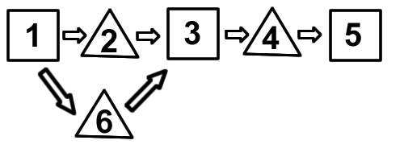

1. {1} is selected, Shift-click {5} => {1,2,3,4,5,6} are selected (every direct path from 1 to 5)
2. {1} is selected, Shift-click {6} => {1,6} are selected
3. {2} is selected, Shift-click {6} => {2,6} are selected (nothing else because no direct paths between them)
4. {4} is selected, Shift-click {6} => {3,4,6} are selected
5. {1,4} are selected, Shift-click {6} => {1,3,4,6} are selected (direct path 1 to 6 plus path 6 to 4)

You can also drag-and-drop from a background point to another background point to select all the nodes currently within the selected rectangular area. Only nodes completely within the area are selected.

##### Left-mouse Operations: Adding Nodes

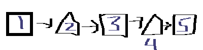

1) Drag-and-drop from {1} to {2}

2) Drag-and-drop from {2} to {1}

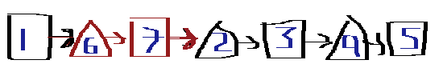

3) Drag-and-drop from {1} to {4}: 

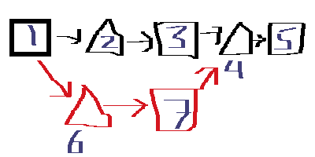

4) Drag-and-drop from {1} to {5}

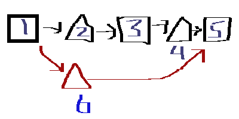

##### Left-mouse Operations: Combining Nodes

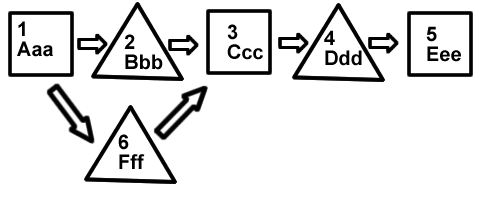

1) Select {4}, Ctrl-C to copy "4 Ddd" to clipboard, select {2}, Ctrl-V to **paste over** text

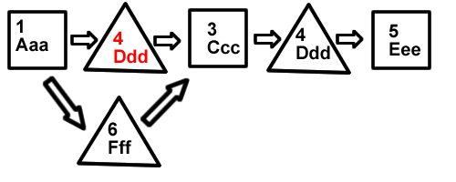

2) Select {4}, Ctrl-C to copy "4 Ddd" to clipboard, select {2}, Ctrl-A to **append** text (Ctrl-A is usually for Select All, but that operation does not sound very useful in this app)

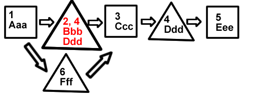

##### Left-mouse Operations: Deleting Nodes

In Quick Mode, you can only delete nodes such that a valid graph remains.

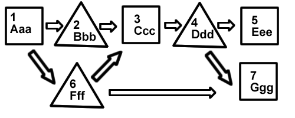

1) Select {4}, click Delete on keyboard -> invalid operation because {3} cannot point to {5}

2) Select {4,5}, click Delete on keyboard

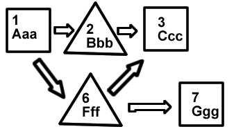

3) Select {3,4}, click Delete on keyboard

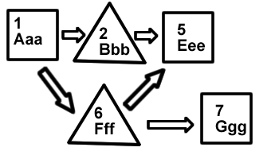

4) Select {6}, click Delete on keyboard

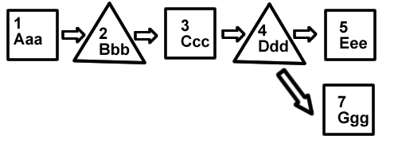

5) Select the {2-3} link, click Delete on keyboard -> invalid operation because {2} must point to a State Node

6) Select the {4-7} link, click Delete keyboard

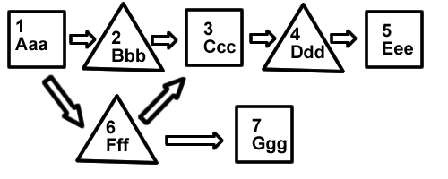
